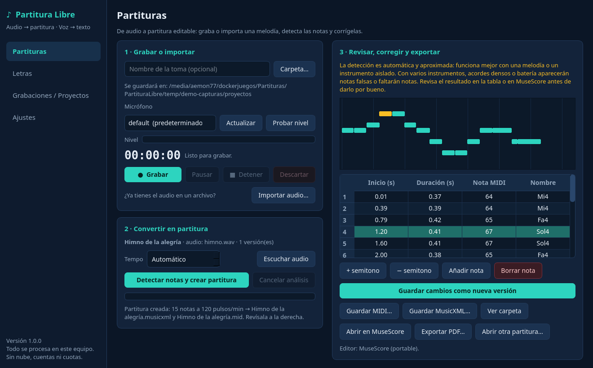
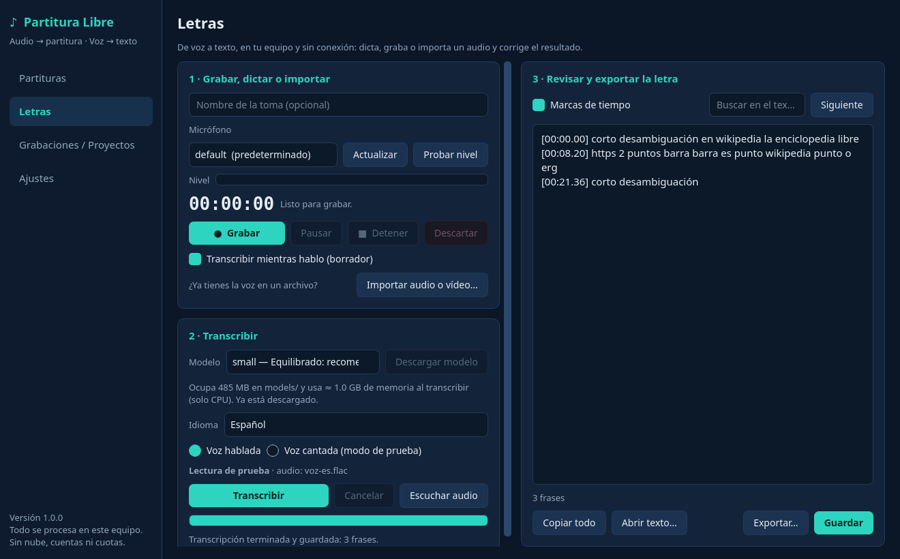

# Partitura Libre

Aplicación de escritorio gratuita para **Windows 11** y **Debian 13** (preparada para Ubuntu 24.04) con dos funciones:

- **Partituras:** graba o importa una melodía, detecta las notas y crea MIDI y MusicXML editables.
- **Letras:** pasa voz (hablada o cantada) a texto editable, con marcas de tiempo.

Todo se procesa en tu equipo: sin cuentas, sin nube, sin cuotas de minutos ni de exportaciones.




## Es portable: una carpeta y nada más

Todo lo que el programa instala o descarga queda **dentro de su carpeta** (`runtime/`, `models/`, `data/`, `config/`, `logs/`, `temp/`). No pide contraseña de administrador y no toca el sistema, el registro ni tu perfil. **Para desinstalarlo, borra la carpeta** (o usa *Ajustes → Desinstalar*).

Lo único que no se borra con ella son las copias que tú exportes a otros sitios; el programa te avisa cada vez.

## Instalación

Necesitas conexión a Internet solo la primera vez y unos **1,6 GB libres** (más los modelos de voz que elijas).

### Debian 13 / Ubuntu 24.04 (64 bits)

```sh
tar -xzf PartituraLibre-1.0.0-linux-x64.tar.gz
cd PartituraLibre
./iniciar-linux.sh
```

### Windows 11 (64 bits)

1. Descomprime `PartituraLibre-1.0.0-windows11-x64.zip` en una carpeta tuya (por ejemplo, Documentos).
2. Doble clic en `iniciar-windows.bat`.

### Qué pasa en el primer arranque

El lanzador muestra lo que va a bajar y lo guarda en `runtime/`:

| Componente | Tamaño en disco |
|---|---|
| Gestor `uv` | ≈ 50 MB |
| Python 3.11 portable | ≈ 90 MB |
| Paquetes «app» (interfaz Qt, audio, voz a texto) | ≈ 650 MB (≈ 460 MB en Windows) |
| Paquetes «partituras» (Basic Pitch, music21) | ≈ 710 MB (≈ 550 MB en Windows) |

Después comprueba que todo se puede importar y abre la ventana. Los siguientes arranques son inmediatos y no usan Internet.

Opcionales, solo cuando pulsas el botón correspondiente:

| Descarga | Tamaño | Dónde |
|---|---|---|
| Modelo de voz `tiny` / `base` / `small` / `medium` / `large-v3` | 75 / 145 / 485 / 1530 / 3090 MB | `models/whisper/` |
| MuseScore Studio 4.7.5 portable | 195 MB (≈ 570 MB descomprimido) | `runtime/musescore/` |

## Uso

### Partituras

1. **Grabar o importar.** Elige el micrófono, pulsa *Probar nivel* para ver si la barra se mueve y después *Grabar*. Puedes pausar, detener o descartar. O importa un WAV, MP3, FLAC u OGG. La toma original se guarda siempre en WAV dentro del proyecto, aunque falle lo demás.
2. **Convertir.** *Detectar notas y crear partitura* analiza el audio con Basic Pitch (se puede cancelar). El tempo se estima solo o lo fijas tú.
3. **Revisar.** Verás las notas en un rollo de piano y en una tabla. Corrige inicio, duración o altura, añade o borra notas y pulsa *Guardar cambios como nueva versión*: se crean archivos nuevos, nunca se pisa lo anterior.
4. **Exportar.** *Guardar MIDI…*, *Guardar MusicXML…*, y con MuseScore: *Abrir en MuseScore* (edición gráfica completa) y *Exportar PDF…*.

> La detección es automática y aproximada. Va bien con una melodía o un instrumento solo. Con varios instrumentos, acordes densos o batería habrá notas falsas o ausentes: revisa siempre el resultado.

### Letras

1. **Elige un modelo** y pulsa *Descargar modelo* (una sola vez). `small` es el recomendado para español; `tiny` y `base` son más rápidos y fallan más; `medium` y `large-v3` son más precisos y lentos.
2. **Graba, dicta o importa** audio o vídeo (WAV, MP3, FLAC, OGG, M4A, MP4, MKV…). Con *Transcribir mientras hablo* aparece un borrador cada pocos segundos; al detener, la toma completa se transcribe de nuevo con más precisión.
3. **Idioma:** español, detección automática u otro de la lista.
4. **Voz hablada o voz cantada (modo de prueba).** Con canto, la música y los coros confunden al modelo: los versos poco fiables se marcan con **⚠** para que los escuches y corrijas. El programa no inventa texto donde no entiende.
5. **Revisa y exporta.** El texto es editable (una línea por frase, marcas `[mm:ss.cc]` opcionales), se puede buscar y copiar, y se exporta a **TXT, SRT, VTT o LRC**.

### Grabaciones / Proyectos

Historial de todas las tomas con su audio y sus resultados. Desde aquí puedes reabrirlas, ver su carpeta, exportar una copia o eliminarlas.

### Ajustes

Modelos de voz, MuseScore portable, **Diagnóstico** (runtime, micrófonos, motores, modelos, editor, espacio libre; guarda un informe en `logs/` sin grabaciones ni datos personales), tamaño de cada carpeta, vaciado de temporales y **desinstalación**.

## Formatos de salida

| Sección | Archivos |
|---|---|
| Partituras | `.wav` (toma original), `.mid`, `.musicxml`, `.notas.json` (notas editables), `.pdf` (con MuseScore) |
| Letras | `.wav` u original importado, `.txt`, `.letra.json` (frases con tiempos), `.srt`, `.vtt`, `.lrc` |

Cada proyecto es una carpeta en `data/proyectos/` (o donde tú elijas).

## Solución de problemas

| Síntoma | Qué hacer |
|---|---|
| El lanzador dice que un conjunto de paquetes no funciona | `./iniciar-linux.sh --reparar` o `iniciar-windows.bat --reparar`. Reinstala dentro de la carpeta, nada global. |
| Quiero ver qué falla sin abrir la ventana | `./iniciar-linux.sh --diagnostico` (o `iniciar-windows.bat --diagnostico`). |
| «No se pudo cargar PortAudio» (Linux) | Falta la biblioteca de audio del sistema `libportaudio2`. El programa no instala nada en el sistema: pídeselo a quien administre el equipo. Mientras tanto puedes importar archivos. |
| La ventana no se abre en una sesión X11 (Linux) | Qt necesita `libxcb-cursor0` del sistema. En sesiones Wayland (las de Debian 13 y Ubuntu 24.04 por defecto) no hace falta. |
| «No se pudo abrir el micrófono» | Otro programa lo está usando o no hay permiso. En Linux elige `default` o `pulse` (los `hw:` directos suelen estar ocupados por PipeWire). En Windows: Configuración → Privacidad y seguridad → Micrófono. |
| «La toma está en silencio» | El micrófono está silenciado, apagado o no es la entrada elegida. Usa *Probar nivel*. |
| «Grabación incompleta» | El equipo iba muy cargado o el disco se llenó. La toma se conserva; el aviso dice cuánto falta. |
| La transcripción se cierra sola | Falta memoria: usa un modelo más pequeño. Detalle en `logs/motores.log`. |
| MuseScore no arranca (Linux) | La copia portable necesita X11 o XWayland (lo normal en escritorios actuales). |
| El programa se cerró mientras grababa | Al volver a abrirlo, la toma aparece como «Interrumpida» con el audio hasta el corte. |

## Para desarrollo

```sh
./herramientas/probar.sh            # todas las pruebas, con el runtime portable
./herramientas/bloquear.sh          # regenera app/requisitos/*.txt (bloqueos con hashes)
python3 herramientas/empaquetar.py  # crea dist/ con los tres paquetes
```

Arquitectura y decisiones: [docs/ARQUITECTURA.md](docs/ARQUITECTURA.md) · Licencias: [docs/LICENCIAS.md](docs/LICENCIAS.md) · Qué se ha probado de verdad: [docs/INFORME-PRUEBAS.md](docs/INFORME-PRUEBAS.md)
